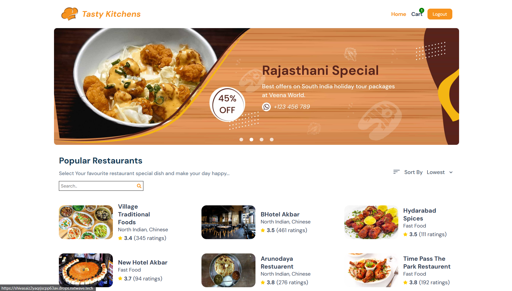

# 🍽️ Tasty Kitchens - Restaurant Discovery App

A React-based restaurant discovery and food ordering platform that showcases restaurants, menus, and allows users to build their food cart.

## ✨ Features

### 🔐 Authentication
- Secure login with JWT token
- Protected routes for authenticated users
- Cookie-based session management

### 🏠 Home Page
- Offers carousel with promotions
- Sortable restaurant listings (Highest/Lowest rating)
- Paginated restaurant browsing
- Fully responsive design

### 🍔 Restaurant Details
- Comprehensive restaurant information
- Interactive menu with food items
- Add to cart functionality

### 🛒 Cart Management
- Persistent cart using localStorage
- Quantity adjustment controls
- Real-time total calculation
- Empty cart state handling

### 🎛️ Additional Features
- Responsive navbar with mobile menu
- Consistent footer across all pages
- 404 Not Found page
- Loading states during API calls

## 🛠️ Technologies Used

- **Frontend**: React (Class Components)
- **Routing**: React Router v6
- **Styling**: CSS3 (No styled-components)
- **Authentication**: JWT tokens
- **State Management**: Component state + localStorage
- **API**: Fetch API for backend communication
- **UI Libraries**: react-icons, react-slick

## 🔍 Testing Credentials

Use the following credentials to test the app:

| Field     | Value         |
|-----------|---------------|
| Username  | `rahul`       |
| Password  | `rahul@2021`  |
